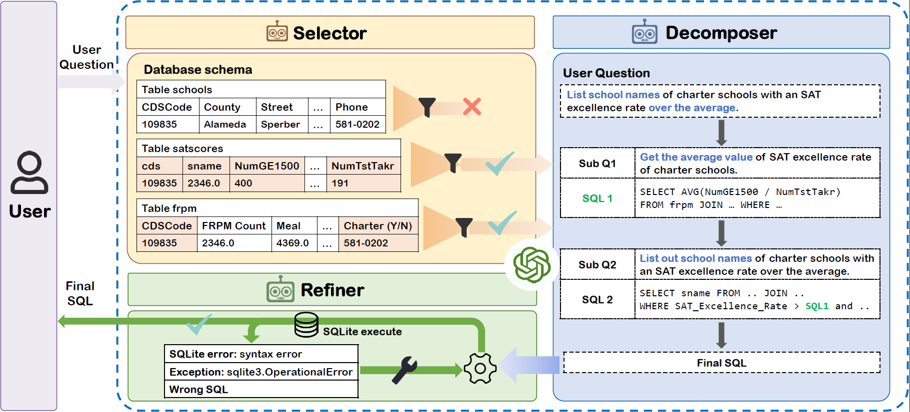

# MAC-SQL: Multi-Agent Collaborative Framework for Text-to-SQL



This project implements MAC-SQL, a novel multi-agent collaborative framework for Text-to-SQL generation. MAC-SQL uses multiple specialized agents that work together to generate accurate SQL queries from natural language questions.

## Overview

MAC-SQL addresses challenges in Text-to-SQL conversion through a collaborative multi-agent approach:

1. **Decomposer Agent**: Core agent for Text-to-SQL generation with few-shot chain-of-thought reasoning
2. **Selector Agent**: Identifies relevant schema elements based on the user query
3. **Refiner Agent**: Refines and fixes SQL queries when execution errors occur

## Requirements

- Python 3.8+
- PostgreSQL database (primary support)
- SQLite database (for BIRD benchmark evaluation)
- Language model API access (Meta Llama 3, Together AI, etc.)

## Installation

```bash
# Clone the repository
git clone https://github.com/leev1tan/langchain.git
cd langchain

# Install dependencies
pip install -r requirements.txt

# Set up environment variables
export TOGETHER_API_KEY=your_api_key_here
```

## Usage

### Basic Usage

```python
from mac_sql import MACSQL

# Initialize MAC-SQL
mac_sql = MACSQL(model_name="meta-llama/Llama-3.3-70B-Instruct-Turbo")

# Connect to database
mac_sql.connect_to_database("your_database_path")

# Execute query
sql_query, results = mac_sql.process_query("Show me all employees in the Sales department")
print(f"SQL Query: {sql_query}")
print(f"Results: {results}")
```

### Evaluation on BIRD Benchmark

```bash
python evaluate_bird.py --samples-per-db 5 --visualize
```

## Project Structure

```
.
├── core/                       # Core components
│   ├── agents.py               # Agent implementations
│   ├── chat_manager.py         # Manages communication between agents
│   └── config.py               # Configuration settings
├── evaluate_bird.py            # BIRD benchmark evaluation script
├── mac_sql.py                  # Main MAC-SQL implementation
├── requirements.txt            # Project dependencies
└── README.md                   # Project documentation
```

## Configuration

Set your API key in one of the following ways:
1. Environment variable: `TOGETHER_API_KEY`
2. Configuration file: Create `config.json` with your API key
3. Pass directly to the MACSQL constructor: `MACSQL(api_key="your_api_key")`

## Citation

If you use MAC-SQL in your research, please cite the original paper:

```bibtex
@article{wang2023macsql,
  title={MAC-SQL: A Multi-Agent Collaborative Framework for Text-to-SQL},
  author={Wang, Bing and Ren, Changyu and Yang, Jian and Liang, Xinnian and Bai, Jiaqi and Chai, Linzheng and Yan, Zhao and Zhang, Qian-Wen and Yin, Di and Sun, Xing and Li, Zhoujun},
  journal={arXiv preprint arXiv:2312.11242},
  year={2023}
}
```

## License

This project is licensed under the MIT License - see the LICENSE file for details.

## Acknowledgements

This implementation is based on the paper "MAC-SQL: A Multi-Agent Collaborative Framework for Text-to-SQL" by Wang et al. (2023) available at [arXiv:2312.11242](https://arxiv.org/abs/2312.11242). 